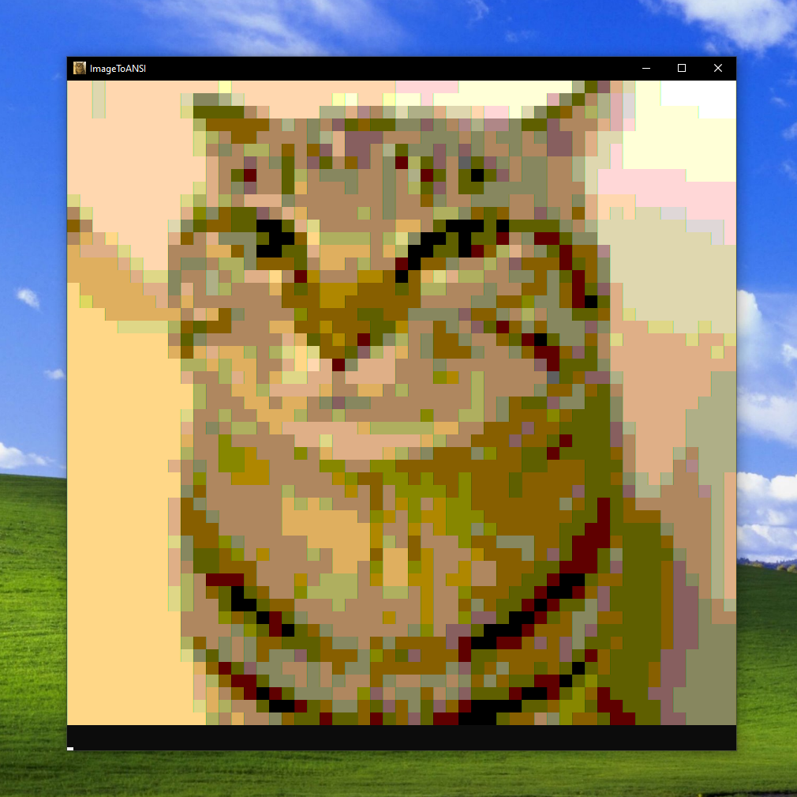

#  ImageToANSI
Простая программа, позволяющая вывести изображение в консоль, используя 216-цветовую палитру. 
Присутствует импорт и экспорт `.ansi` файлов (изображение в виде текста). 
Все `.ansi` файлы будут сохраняться в папку   **Saves** в папке с программой. 
Пример такого файла: https://github.com/Zest4ek/ImageToANSI/blob/main/Saves/example.txt

 **Примечание:** Конвертируйте изображение в `.png`, `.jpg` или `.jpeg` и не расширяйте окно консоли, чтобы избежать визуальных багов! 
 **OS:** Windows 
 **Version:** pre-1.0

- [x] Добавить импорт и экспорт ANSI файла
- [ ] Испечь торт

